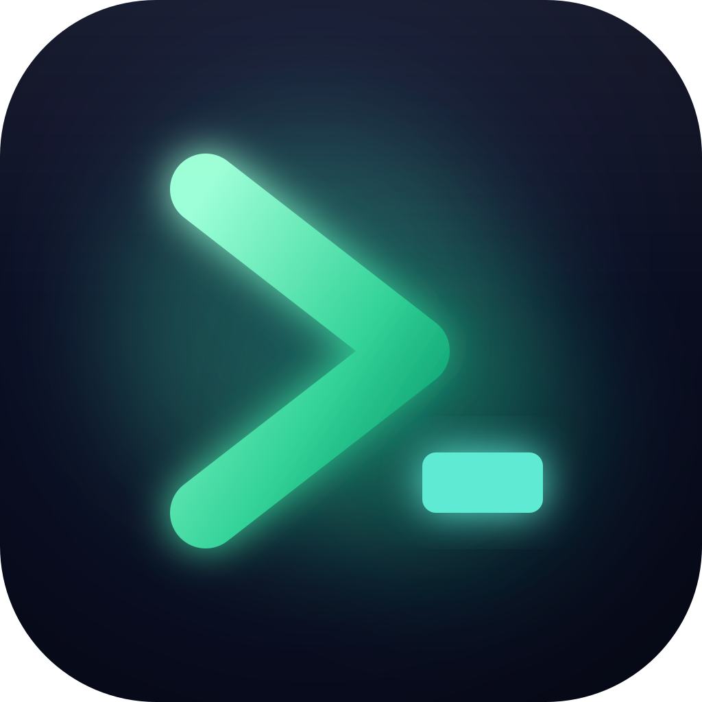

<p align="center">
  
</p>

<h1 align="center">Clinch</h1>

<p align="center">
  <strong>The local-first macOS terminal for Claude Code and Codex.</strong>
</p>

<p align="center">
  Keep projects, panes, and AI coding sessions organized—and return to the conversation,
  not just the directory.
</p>

<p align="center">
  <a href="https://clinch.sh"><strong>Website</strong></a> ·
  <a href="#install"><strong>Install</strong></a> ·
  <a href="https://clinch.sh/docs"><strong>Docs</strong></a> ·
  <a href="https://github.com/elliot-ylambda/clinch-terminal/releases"><strong>Releases</strong></a>
</p>

<p align="center">
  <sub>macOS 14+ · Intel and Apple Silicon · free and open source · no account ·
  <a href="#privacy-and-network-behavior"><strong>no telemetry</strong></a> ·
  <a href="#public-preview">public preview</a></sub>
</p>

---

Clinch is an independent AGPL fork of Warp designed for people who keep several AI coding threads
moving at once. Project tabs keep terminal tabs, splits, working directories, panels, and local
agent state grouped as durable workspaces. With session capture enabled, Clinch can reopen a
recoverable Claude Code or Codex conversation in the pane that owned it.

The stable app runs without a Clinch or Warp account and without a configured Warp backend,
telemetry destination, or crash reporter. Clinch keeps its own UI configuration, so it can run
alongside Warp without inheriting Warp's settings.

## Why Clinch

- **Pick up where the agent left off.** Reopen captured Claude Code and Codex conversations in
  their original panes when the provider transcript is still recoverable.
- **Keep parallel projects separate.** Preserve project order, working directories, terminal
  tabs, splits, and panels—and move live tabs between projects or windows.
- **See what needs attention.** Local agent-status badges and macOS notifications help surface a
  waiting or completed agent without sending Clinch telemetry.
- **Stay close to the work.** Browse skills and files, preview common image formats, and monitor
  optional Claude plan limits without leaving the terminal.
- **Stay local-first.** No telemetry, no analytics, no crash reporting, no account. Clinch
  collects nothing about you or your work, and the only thing it reaches for on its own is a
  weekly update check against this repository—which you can turn off. See
  [Privacy and network behavior](#privacy-and-network-behavior)—including how to verify it
  yourself.

## Install

Copy this into your terminal to download and install Clinch:

```bash
curl -fsSL https://clinch.sh/install | sh
```

The URL redirects to the authenticated `install.sh` asset on the latest versioned release. The
script authenticates the signed release manifest with a Clinch release key embedded in the
reviewed script. It resolves one exact tag, verifies the archive size and SHA-256, bundle ID,
version, minimum macOS version, Intel and Apple Silicon slices, and structural code signature,
then stages the app in `/Applications` or `~/Applications` and opens it (pass `--no-open` to
skip launching). It does not configure Claude Code or Codex, install plugins, request
administrator access, or change Gatekeeper. Command-line downloads carry no browser quarantine
flag, so Gatekeeper does not block the first launch and no System Settings approval is needed.
To read the script before running it, download `install.sh` from a versioned release, inspect
it, then run `sh install.sh`.

### Manual verification

Every current versioned release on the
[Clinch releases page](https://github.com/elliot-ylambda/clinch-terminal/releases) also ships
the artifacts to verify and install by hand. Download `Clinch.dmg`, `Clinch.source.tar.gz`,
`Clinch.checksums.txt`, and `Clinch.checksums.sshsig` from the same release. The source archive is
the version-matched Complete Corresponding Source, including every locked Cargo dependency.
Authenticate the checksum list with the Clinch release key, then verify the disk image and source
archive before opening or extracting them:

```bash
printf '%s\n' 'clinch-release ssh-ed25519 AAAAC3NzaC1lZDI1NTE5AAAAIGr+qT8+Fx8TjATDpWlhzzfbL08AsS1EXbaaOUBi0wJp' > /tmp/clinch-allowed-signers
ssh-keygen -Y verify -f /tmp/clinch-allowed-signers -I clinch-release -n clinch-checksums \
  -s Clinch.checksums.sshsig < Clinch.checksums.txt
shasum -a 256 Clinch.dmg
grep ' Clinch.dmg$' Clinch.checksums.txt
shasum -a 256 Clinch.source.tar.gz
grep ' Clinch.source.tar.gz$' Clinch.checksums.txt
```

`ssh-keygen` must report a good signature, and each printed digest must match its authenticated
entry. Open the DMG and drag
`Clinch.app` to Applications. A browser download is quarantined and the preview is not notarized,
so macOS will block the first launch: try once, then approve Clinch under **System Settings →
Privacy & Security → Open Anyway**. Do not disable Gatekeeper globally. Clinch's installer and
documentation do not remove `com.apple.quarantine`.

Clinch uses the bundle ID `sh.clinch.Clinch` and keeps its UI configuration in `~/.clinch`, so it
can coexist with Warp without inheriting Warp's theme, zoom, keybindings, or other app settings.

## Session restore is enabled by default

Clinch can reopen a captured Claude Code or Codex conversation in the pane that owned it. This
requires provider hooks, so Clinch enables its local session-capture integration on first launch.
You can turn it off or back on at any time from **Clinch Settings → Agents → Claude Code and Codex
session capture**.

While session capture is enabled, Clinch:

- adds clearly marked managed hooks to `~/.claude/settings.json` and `~/.codex/config.toml`;
- installs Clinch-owned helper files in `~/.warp/agent-resume-bin/`; and
- stores local pane mappings, a journal, and prompt mirrors in `~/.warp/agent-resume/`; and
- records the enabled/disabled preference and a hash/mode receipt under
  `~/Library/Application Support/sh.clinch.Clinch/agent-integration/`.

Clinch repairs those managed entries on later launches only while the setting is enabled. Turning
it off persists the opt-out and deletes its hooks and helper files while preserving unrelated
provider configuration and captured metadata. Purging captured metadata is a separate action. The
command-line equivalents are:

```bash
bash tools/agent-resume/install.sh enable
bash tools/agent-resume/install.sh disable
bash tools/agent-resume/install.sh purge
```

Notification plugins are separate from session capture. Clinch ships pinned snapshots of the
Warp notification plugins for Claude Code and Codex and best-effort installs them into the
provider-owned user plugin stores on launch when those CLIs are present. The payload is local to
the Clinch app and uses dedicated Clinch marketplace IDs, so installation neither clones a plugin
repository nor replaces other Warp/Oz marketplace plugins. The app also puts a pinned universal
`jq` on each local pane's `PATH`, satisfying the plugins' runtime dependency without Homebrew.
Missing CLIs and provider policy failures do not block launch and are retried later. Use
`./uninstall.sh --remove-plugins` when you want to remove the provider plugins as well as Clinch.

Conversation recovery is best-effort. Clinch starts a new provider process with a resume command;
it does not preserve a live process through quit, crash, or reboot. Provider retention, invalid or
deleted transcripts, changed CLIs, and abrupt power loss can prevent an exact restore.

More implementation detail is in
[tools/agent-resume/README.md](tools/agent-resume/README.md).

## Public preview

Clinch is distributed as an **unnotarized public preview**. The app is ad-hoc signed with the
macOS hardened runtime, but it has no Apple-issued Developer ID and Apple has not notarized it.
macOS may block the first launch. That warning is expected and is not evidence that Apple has
reviewed the app.

This repository has automated security checks and a documented release process. It has not had an
independent security audit. See [SECURITY.md](SECURITY.md) for the trust model and known limits.

## Privacy and network behavior

**Clinch has no telemetry, no analytics, no crash reporting, and no account.** It does not
collect or transmit anything about you, your commands, your files, or how you use the app. No
usage data, no event stream, and no identifier ever leaves your machine. This is a property of
how the app is built, not a preference you have to find and switch off.

The stable channel is created by
[`ChannelConfig::clinch()`](crates/warp_core/src/channel/config.rs), which ships
`telemetry_config: None`, `crash_reporting_config: None`, and no bundled MCP credentials. Every
inherited Warp backend URL—application server, real-time server, and Oz—is replaced with an
unroutable [RFC 5737](https://www.rfc-editor.org/rfc/rfc5737) black-hole address rather than
merely left unused, so no code path can deliver data to a Warp service even by accident. Account
login, onboarding, Warp Drive, session sharing, and Warp's own AI are gated behind
`ChannelState::has_backend()` and are inert. Every telemetry entry point—including the innermost
send—returns early when telemetry is unavailable, so the runtime schedules no telemetry task,
writes no queue to disk, and deletes stale Clinch telemetry queues without uploading them.

The shipped binary links no crash-reporting framework and contains no RudderStack destination,
Sentry DSN, or analytics SDK. The bundle requests no entitlements at all, and carries no
privileged update authorizer.

### What talks to the network

| Activity | Runs when | Destination |
| --- | --- | --- |
| Update check | Automatically, at most once a week — **and you can turn it off** | `api.github.com`, this repository's releases |
| Update download | Only after you approve the update | GitHub release assets |
| Claude plan-limit gauges | **Off by default**; only if you enable them in Settings | `api.anthropic.com` |
| Language servers, MCP servers, remote assets | Only when you start them | Wherever you point them |
| Claude Code, Codex, SSH, package tooling | Only when you run them | Their own services |

The update check is an ordinary HTTPS GET for signed release metadata. Clinch attaches no
identifier, machine fingerprint, or usage data to it, and it downloads nothing until you approve
the update. A successful check is not repeated for another week; a failed one backs off for six
hours rather than retrying on every window focus.

**To make Clinch issue no automatic network requests at all**, turn off **Settings → Clinch →
Updates → Check for updates automatically**. Checking on demand from **Clinch → Check for
Updates…** keeps working, so turning this off does not strand you on an old build. The equivalent
without opening the GUI:

```bash
# In ~/.warp/settings.toml
[clinch.updates]
automatic_check = false

# Or per-launch, which overrides the setting
CLINCH_NO_UPDATE_CHECK=1 open -a Clinch
```

Software you launch inside Clinch is outside this statement. Provider CLIs, MCP servers, SSH, and
package tooling reach their own services under your own accounts, with their own privacy behavior.

### Verify it yourself

None of the above has to be taken on trust:

```bash
# No crash reporter linked, and no bundled frameworks at all
otool -L /Applications/Clinch.app/Contents/MacOS/stable | grep -i sentry
ls /Applications/Clinch.app/Contents/Frameworks

# No analytics destination or crash-reporting DSN compiled in
strings -a /Applications/Clinch.app/Contents/MacOS/stable \
  | grep -Ei 'rudderstack\.com|ingest\.sentry\.io|segment\.io|amplitude\.com'

# No entitlements requested (prints an empty <dict/>)
codesign -d --entitlements - /Applications/Clinch.app

# Every socket the running app holds open
lsof -nP -i -a -p "$(ps -Ao pid,comm | awk '/Clinch.app\/Contents\/MacOS\/stable/{print $1; exit}')"
```

Expected results: the two `grep` commands match nothing, `ls` reports that no `Frameworks`
directory exists, `codesign` prints an empty `<dict/>`, and `lsof` shows no sockets most of the
time—only GitHub connections around a daily update check. Nothing should ever resolve to a Warp
service or an analytics host.

These invariants are also locked by tests in
[`config_tests.rs`](crates/warp_core/src/channel/config_tests.rs): a change that reintroduced a
telemetry destination, a crash reporter, or a live backend URL fails the build.

Session-capture data stays in local Clinch-owned files. Claude Code and Codex continue to manage
their own transcripts and credentials. Clinch does not delete provider transcripts or Keychain
credentials during uninstall.

## Updates and removal

Updater-enabled builds check automatically and show **Update available** in the header. You can
also choose **Clinch → Check for Updates…**. Clinch authenticates the release and presents its
version and notes; **Download and Install** then verifies the archive, saves restorable state,
quits, atomically replaces the app, relaunches, and rolls back if the new app does not start.

The updater never requests administrator privileges. The public installer places Clinch in a
user-writable `/Applications` or `~/Applications` location; unusual non-writable installations
open the authenticated release for manual installation instead. Builds released before the updater
bridge in `v0.2026.07.20.1643` need one final bootstrap install:

```bash
curl -fsSL https://clinch.sh/install | sh
```

The release asset `uninstall.sh` supports selective removal:

```bash
bash uninstall.sh                         # app only
bash uninstall.sh --disable-integration  # app plus managed hooks/helpers
bash uninstall.sh --purge-capture        # also remove captured metadata
bash uninstall.sh --purge-app-data       # also remove Clinch preferences/cache/state
```

Run `bash uninstall.sh --help` for combinations. It never removes all of `~/.warp`, provider
transcripts, or Keychain credentials.

## Build and verify from source

```bash
./script/bootstrap
./script/install_cargo_test_deps
./script/launch-check
make candidate
```

`script/launch-check` covers formatting, installer/integration/update-format tests, the stable
build, component tests, Clippy, dependency license policy, bundled notices, and advisories. `make
candidate` builds and verifies the universal app, ZIP, DMG, both manifest signatures, minimum OS,
entitlements, default-on/opt-out flow, and ZIP/DMG app equality. It does not create a tag or release.

Release builds use the persistent local Cargo cache instead of paid hosted macOS runners. Install
the normal build/test/release dependencies plus OpenSSL 3 and Syft (`brew install openssl@3 syft`)
before the first release; `make release` checks every required command, signing key, and at least
40 GiB of free space before starting the expensive gate.

Run `make release` from a clean, current `main` checkout. It selects the next version, records the
exact commit, and creates a detached worktree pinned to that commit at a stable per-repository path.
The worktree uses the dedicated `target/release-worktree-cache/` directory, and its stable source
path keeps incremental Cargo fingerprints reusable across releases without conflicting with normal
development builds. Edits made in the caller's checkout after the release starts cannot dirty or
change the release source. The command runs the full local
gate, builds and verifies both macOS architectures, generates a CycloneDX SBOM, a vendored
offline-buildable Corresponding Source archive, and signed local provenance, then assembles the
exact signed asset set under `target/release-worktree-cache/release-stage/<version>/`.
The release-only Nextest profile permits up to 120 seconds for macOS UI tests whose first system-font
scan can consume most of the stricter 60-second local timeout; test assertions and selection are
unchanged.
After a version-and-commit-specific publication confirmation,
it pushes the signed tag, creates or refreshes a private draft release, downloads the uploaded
assets into a fresh directory, verifies them again, and publishes the draft. The command does not
require or record a manual QA attestation. Advanced users can override `VERSION`.

Release publication runs no GitHub Actions job. Immediately before publication, the local command
rechecks the signed remote tag, current `main`, both manifest signatures, exact asset set and
digests, SBOM, validation record, local provenance, and monotonic update sequence. It also rejects
a draft whose metadata changes during or after download. A failure leaves the draft private and
safe to retry. Verified progress is stored by commit under
`target/release-worktree-cache/release-resume/`: a retry first
revalidates existing candidate or staged artifacts and skips completed build phases only when those
checks still pass. Set `CLINCH_RELEASE_RESUME=0` to force a fresh run.

On hosts with at least 32 GiB of RAM and 8 logical CPUs, Intel and Apple Silicon builds run in
parallel with half of the Cargo job budget assigned to each architecture. The secondary target uses
its own persistent Cargo root under `target/release-worktree-cache/parallel-arch-cache/` so Cargo's
target-directory lock cannot silently serialize the builds; its final binary and dSYM are staged
back into the canonical target tree for universal bundling. Smaller hosts fall back to sequential
builds. Set `CLINCH_PARALLEL_ARCH_BUILDS=0` to force sequential builds or `=1` to force parallel
builds; `CLINCH_PARALLEL_ARCH_JOBS` controls the per-architecture Cargo job count.
The native build also produces the settings-schema generator, which bundling executes directly
instead of launching a second release-LTO Cargo build. The universal artifact verifier always
checks that both Intel and Apple Silicon slices are present.

After these changes land on `main`, run `make configure-release-repository` once. It validates both
workstation key copies before deleting the obsolete GitHub signing secrets and `public-release`
environment, then reapplies branch, scanning, Actions-token, and immutable-release controls.

## License and attribution

Clinch is a modified version of [Warp](https://github.com/warpdotdev/warp), licensed under
[AGPL-3.0](LICENSE-AGPL). The `warpui_core` and `warpui` crates remain under
[MIT](LICENSE-MIT).

Clinch is not affiliated with or endorsed by Warp or Denver Technologies, Inc. “Warp” is their
trademark.

AGPL software may be sold. A paid Clinch download, subscription, support plan, or hosted service
must preserve recipients' AGPL rights: they may run, inspect, modify, fork, and redistribute the
covered code, including commercially. Clinch cannot add a no-fork, noncommercial, or no-resale
restriction to the inherited AGPL code. A commercial distributor does not have to use a public
GitHub repository, but it must provide the Complete Corresponding Source and required notices in
the manner and for the periods required by the AGPL; network users must also receive the AGPL
source offer. Code for which all relevant copyrights are separately controlled could be offered
under another license, but that does not relicense the inherited AGPL portions.

Those copyright permissions do not grant rights to Warp trademarks or guarantee access to any
Warp-operated service. Before charging for Clinch, separately review branding, hosted-service
terms, privacy disclosures, payment/tax obligations, and every non-code asset or integration used
by the commercial offering. This repository's notices and release checks reduce known licensing
risk; they are not a substitute for advice from counsel about a particular launch.
