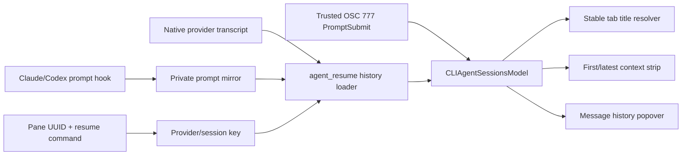

# Claude and Codex Session Context — Technical Plan

## Context

This plan implements the behavior in [PRODUCT.md](./PRODUCT.md) against Clinch commit
`4bc1dbffd19d5e4c83abad8bd67fb060c1f03977`. It changes inner terminal tabs and panes; the
outer project-tab label intentionally remains the repository/directory name. Gate the new UI and
history recovery on Clinch channel capability so shared Warp builds keep their current behavior.

The current CLI-agent model is transient and pane-view-scoped. [`CLIAgentSessionContext` stores one
overwritten `query`, not an initial prompt or history](https://github.com/elliot-ylambda/clinch-terminal/blob/4bc1dbffd19d5e4c83abad8bd67fb060c1f03977/app/src/terminal/cli_agent_sessions/mod.rs#L40-L51),
and [`CLIAgentSessionsModel` keys sessions by the ephemeral terminal-view ID](https://github.com/elliot-ylambda/clinch-terminal/blob/4bc1dbffd19d5e4c83abad8bd67fb060c1f03977/app/src/terminal/cli_agent_sessions/mod.rs#L305-L329).
`PromptSubmit` and `Stop` both replace `query`, which is suitable for notifications but cannot
distinguish the first turn or build a history
([`apply_event`](https://github.com/elliot-ylambda/clinch-terminal/blob/4bc1dbffd19d5e4c83abad8bd67fb060c1f03977/app/src/terminal/cli_agent_sessions/mod.rs#L179-L209)).

Tab titles already flow through the terminal pane configuration. `TerminalView` chooses CLI-agent
text ahead of the terminal title
([`update_pane_configuration`](https://github.com/elliot-ylambda/clinch-terminal/blob/4bc1dbffd19d5e4c83abad8bd67fb060c1f03977/app/src/terminal/view/pane_impl.rs#L118-L154)),
but the CLI resolver follows the default-off “latest prompt as title” setting and otherwise asks for
`summary`, which is often absent or permission-scoped
([`selected_cli_agent_title_for_chrome`](https://github.com/elliot-ylambda/clinch-terminal/blob/4bc1dbffd19d5e4c83abad8bd67fb060c1f03977/app/src/terminal/view/pane_impl.rs#L1068-L1081)).
Manual tab titles already override generated titles and remain the correct top-level precedence
([`PaneGroup::display_title`](https://github.com/elliot-ylambda/clinch-terminal/blob/4bc1dbffd19d5e4c83abad8bd67fb060c1f03977/app/src/pane_group/mod.rs#L5105-L5137)).

Structured OSC 777 events carry `session_id`, `query`, and an optional `transcript_path`, but
listener registration currently drops the transcript path
([event payload](https://github.com/elliot-ylambda/clinch-terminal/blob/4bc1dbffd19d5e4c83abad8bd67fb060c1f03977/app/src/terminal/cli_agent_sessions/event/mod.rs#L10-L62),
[registration](https://github.com/elliot-ylambda/clinch-terminal/blob/4bc1dbffd19d5e4c83abad8bd67fb060c1f03977/app/src/terminal/view.rs#L13077-L13164)).
Codex's OSC 9 fallback is deliberately opaque and maps notification text to a `Stop`; it must not
be accepted as user-authored history
([`CodexSessionHandler`](https://github.com/elliot-ylambda/clinch-terminal/blob/4bc1dbffd19d5e4c83abad8bd67fb060c1f03977/app/src/terminal/cli_agent_sessions/listener/mod.rs#L91-L149)).

Clinch already has the durable sources needed for restoration:

- Claude's opted-in capture hook appends exact `UserPromptSubmit` payloads to a private, 5 MB-capped
  prompt mirror
  ([`claude-capture.sh`](https://github.com/elliot-ylambda/clinch-terminal/blob/4bc1dbffd19d5e4c83abad8bd67fb060c1f03977/tools/agent-resume/claude-capture.sh#L159-L195)).
- `agent_resume.rs` can locate Claude and Codex transcripts and extract one first prompt today;
  these parsers should be generalized rather than duplicated
  ([conversation aggregation](https://github.com/elliot-ylambda/clinch-terminal/blob/4bc1dbffd19d5e4c83abad8bd67fb060c1f03977/app/src/agent_resume.rs#L380-L449),
  [transcript parsers](https://github.com/elliot-ylambda/clinch-terminal/blob/4bc1dbffd19d5e4c83abad8bd67fb060c1f03977/app/src/agent_resume.rs#L592-L791)).
- A terminal snapshot already stores a stable pane UUID and the provider resume command containing
  the session ID, but no prompt context
  ([`TerminalPaneSnapshot`](https://github.com/elliot-ylambda/clinch-terminal/blob/4bc1dbffd19d5e4c83abad8bd67fb060c1f03977/app/src/app_state.rs#L261-L276)).
- Codex capture originally wired only `SessionStart` and `SessionEnd`; the implementation verifies
  the installed `codex-cli 0.144.3` `UserPromptSubmit` schema before adding it to the managed block
  ([installer](https://github.com/elliot-ylambda/clinch-terminal/blob/4bc1dbffd19d5e4c83abad8bd67fb060c1f03977/tools/agent-resume/install.sh#L122-L140),
  [known caveat](https://github.com/elliot-ylambda/clinch-terminal/blob/4bc1dbffd19d5e4c83abad8bd67fb060c1f03977/tools/agent-resume/README.md#L236-L242)).

Ordinary terminal panes currently hide their header unless sharing, fullscreen Agent View, or a
special split state requires it
([`should_render_header`](https://github.com/elliot-ylambda/clinch-terminal/blob/4bc1dbffd19d5e4c83abad8bd67fb060c1f03977/app/src/terminal/view/pane_impl.rs#L716-L740)).
The generic custom-header path clips all content to 34 px
([`PaneHeader::render`](https://github.com/elliot-ylambda/clinch-terminal/blob/4bc1dbffd19d5e4c83abad8bd67fb060c1f03977/app/src/pane_group/pane/view/header/mod.rs#L716-L771)),
so the new context strip needs an explicit height contract. The existing dropdown/overlay stack
already provides the correct anchoring and focus pattern
([`Dropdown`](https://github.com/elliot-ylambda/clinch-terminal/blob/4bc1dbffd19d5e4c83abad8bd67fb060c1f03977/app/src/view_components/dropdown.rs#L640-L720)).

## Proposed changes

### 1. Add a provider-session prompt-history API

Generalize `app/src/agent_resume.rs` from “find one first prompt” to a reusable history API:

```rust
pub struct AgentPrompt {
    pub timestamp: Option<String>,
    pub text: String,
}

pub struct AgentPromptHistory {
    pub prompts: Vec<AgentPrompt>,
    pub is_partial: bool,
}

pub enum AgentResumeProvider { Claude, Codex }

pub fn read_prompt_history(
    provider: AgentResumeProvider,
    session_id: &str,
    transcript_path: Option<&Path>,
) -> AgentPromptHistory;
```

Keep exact message text in `AgentPrompt`. Put display-only normalization in a separate pure helper:
collapse whitespace, take the first sentence when it ends within 80 grapheme clusters, otherwise
take 80 graphemes and append `…`. Add a direct `unicode-segmentation` dependency to `app` if the
crate is not already available there; byte or scalar truncation can split visible characters.

History source precedence is deterministic:

1. A non-empty provider prompt mirror is canonical.
2. Otherwise use the event's retained `transcript_path` when it is safe and matches the provider.
3. Otherwise locate the provider's native transcript by session ID under the existing configured
   Claude/Codex roots.
4. If no durable source exists, return an empty history and let trusted live events populate it.

Read JSONL line by line on a blocking worker, tolerate malformed individual records, preserve
repeated identical prompts as distinct turns, and surface the existing cap/truncation marker through
`is_partial`. Generalize `first_prompt_from_claude_transcript` and
`first_prompt_from_codex_transcript` into all-prompt parsers, then implement the existing first-prompt
picker in terms of `prompts.first()` so the conversation finder keeps its current behavior. Retain
the existing generated-Codex-context filter.

Use provider-scoped mirror paths for new data:

```text
~/.warp/agent-resume/prompts/claude/<session-id>.jsonl
~/.warp/agent-resume/prompts/codex/<session-id>.jsonl
```

Continue reading legacy flat `prompts/<session-id>.jsonl` files as Claude history. Update the
existing conversation-list aggregation and local recovery snapshots to understand both layouts.
Do not add prompt bodies to logs, telemetry, crash metadata, command-line arguments, or SQLite.

### 2. Complete opted-in Codex capture

The compatibility probe against installed `codex-cli 0.144.3` and its matching tagged OpenAI source
verified the `UserPromptSubmit` stdin schema. The synthetic fixture records field names only:
`session_id`, `turn_id`, optional `agent_id`/`agent_type`, `transcript_path`, `cwd`,
`hook_event_name`, `model`, `permission_mode`, and exact `prompt`. The required event, session, cwd,
and prompt fields are covered by the shell fixture so future schema drift fails open.

Add a separate prompt-submit helper and a managed Codex `UserPromptSubmit` block in
`tools/agent-resume/install.sh` and `config.toml.snippet`. The helper only appends prompt history; it
must not rewrite the pane's resume command or flags, which avoids the failure called out in the
current README. Extract/share the Claude mirror append logic so both providers get identical JSON
escaping, 0700/0600 permissions, append-only behavior, and the existing cap/one-marker semantics.
Pass prompt content over stdin, never as argv.

This remains part of Clinch's existing explicit “Claude Code and Codex session capture” opt-in.
`disable` stops future hook writes while preserving captured data, and `purge` removes provider
history under its existing destructive semantics. When capture is disabled, live structured events
still power the current-run UI and native transcripts provide best-effort restoration; Clinch does
not silently install hooks or create a second durable prompt store.

If the supported Codex version does not expose a trustworthy prompt payload, do not guess. Keep the
native rollout transcript as the durable Codex source and document that the header may briefly load
after resume; structured `PromptSubmit` remains the live source.

### 3. Model prompt history separately from status context

Add a history field to `CLIAgentSession`, not `CLIAgentSessionContext`. `StatusChanged` currently
clones the context; placing an unbounded vector there would clone the complete history on every
status transition.

Suggested state:

```rust
pub struct CLIAgentSessionKey {
    provider: AgentResumeProvider,
    session_id: String,
}

pub enum PromptHistoryLoadState {
    NotRequested,
    Loading { key: CLIAgentSessionKey, generation: u64 },
    Ready(AgentPromptHistory),
    Unavailable,
}
```

Expose model helpers for `first_prompt`, `latest_prompt`, `prompt_count`, and the derived title.
Append only `RichPlugin + PromptSubmit` events to live history. Never append `Stop`, Codex OSC 9,
permission summaries, tool output, or idle notifications. A repeated user submission remains a new
turn; duplicate delivery of one structured event should be suppressed at the listener/event-id
boundary when an ID is available.

Retain `transcript_path` in session context when structured events provide it. When a stable
`session_id` first appears or changes, start an async `read_prompt_history` task. Apply its result
only if the view still has the same `(provider, session_id, generation)`. Merge prompt events that
arrived during loading by exact-text occurrence ordinal, not by a set of strings, so two intentional
identical submissions survive while the same persisted/live occurrence does not duplicate.

Emit the existing `SessionUpdated` event after history load or live append. That already invalidates
the pane and workspace chrome, so no new global notification path is needed.

### 4. Seed restored and reopened panes before the agent emits a new event

Make the existing resume-command parser return a public `(provider, session_id)` seed. At pane
restore, restart, undo-close, and `RestartSpec` creation, derive this seed from the already persisted
`on_restore_command` and associate it with the new terminal view. This lets history hydration begin
without waiting for a new `SessionStart` and avoids an SQLite migration or duplicated prompt cache.

Carry the stable pane UUID alongside the seed so, when the opted-in registry is available, UI
history can verify that the provider/session is still the outer owner for that pane. Ignore stale
async results and nested-agent events that do not match the current owner. A new session ID resets
the visible history; the same resumed session ID reuses it.

For continuously running command-detected sessions, also consult that pane registry on session
start/status lifecycle events. This supplies native Codex's durable ID even when its fallback OSC 9
notification is intentionally treated as opaque. Upgrade an existing same-provider model entry in
place so its PTY listener, status, input state, and draft survive; reset only history associated
with a different identity. Defer the model mutation outside the current model-emission callback.

### 5. Resolve stable tab titles from the initial prompt

Change CLI-agent chrome resolution to:

```text
manual tab/pane title
  > latest prompt (only when the existing explicit latest-prompt preference applies)
  > initial prompt excerpt
  > trustworthy agent title/summary
  > existing terminal/repository/directory fallback
```

With the latest-prompt preference off (the default), the initial prompt is the canonical CLI-agent
conversation title. This explicitly reconciles APP-4080: Oz behavior is unchanged; for Claude and
Codex, the newly recovered initial prompt is stable title-like metadata, while the opt-in latest
behavior remains available.

Replace boolean “is conversation title” checks in `TerminalView`/`TabComponent` with an explicit
title-origin enum so prompt titles end-clip even when tab status indicators are disabled. The tab
tooltip should expose the complete initial prompt while retaining agent/status information. Keep
outer project-window naming and manual overrides unchanged.

Use the same resolver in horizontal tab/pane chrome and vertical-tab conversation text. Search may
index both initial and latest prompts, but the visible row must follow the selected preference.

### 6. Add a variable-height CLI-agent context header

Extend the generic `HeaderContent::Custom` contract with an explicit content height (default 34 px
for existing callers). Remove the unconditional 34 px clamp for custom content and constrain using
the supplied height. Add regression tests for standard headers and existing Agent View secondary
rows.

For a recognized Claude/Codex session with a loading or non-empty history, make
`TerminalView::should_render_header` return true. Render:

- the existing 34 px draggable title/actions row; and
- a non-draggable context strip below it containing the first preview, latest preview, and fixed-
  priority `Message history (N)` trigger.

The context strip should have a bounded height and responsive flex behavior: shrink/ellipsis the
message previews first, never the history trigger; collapse identical first/latest content into one
labeled preview. It must not alter terminal focus on render or pane selection.

Use the existing anchored `Dropdown` overlay with rich multiline items rather than flattening
prompts into single-line labels. Give the menu a bounded height, chronological rows, complete text,
optional timestamps, keyboard scrolling, Escape/outside-click close, and focus restoration to the
terminal. Keep the overlay outside the draggable region and outside the header's clip bounds. A
separate selectable-text/export surface is a non-goal for the first version.

Use a Clinch-specific channel/capability check for the title resolver, restore hydration, and header
gate. Keep that separate from capture consent: a Clinch session can show trusted live prompts while
capture is disabled, but it cannot silently install hooks or promise the durable mirror. Stock Warp
must not acquire the new header, title precedence, or `~/.warp/agent-resume` reads.

## End-to-end flow



On resume, the persisted command supplies the key, the loader reads in the background, and the
model checks the key/generation before publishing. Live prompt events may arrive in parallel and are
merged before `SessionUpdated` redraws all three surfaces.

## Testing and validation

Map tests directly to PRODUCT behavior:

- **History parser/unit tests (Behavior 1–5, 18, 23–30):** exact multiline text, timestamps,
  malformed lines, truncation marker, legacy Claude path, Claude native transcript fallback, Codex
  `event_msg` and `response_item` forms, generated Codex context filtering, repeated identical
  prompts, and 80-grapheme/first-sentence title derivation.
- **Session-model tests (Behavior 14, 22–27, 32):** append only trusted rich `PromptSubmit`, never
  `Stop`/OSC 9; first prompt remains stable; latest advances; loading/live merge; stale generation
  ignored; session-ID change resets; same-ID resume restores; nested/non-owner session rejected.
- **Title tests (Behavior 4–9):** default first-prompt title, explicit latest-prompt preference,
  manual override, summary/terminal fallback, end clipping independent of status-indicator setting,
  split focus, tooltip full text, and unchanged project-tab label.
- **Header/popover tests (Behavior 10–21):** header gating, loading, one-message collapse, multiple
  previews/count, narrow layout, variable custom-header height, scroll bounds, full multiline text,
  keyboard open/close, outside click, focus restoration, and no terminal input dispatch.
- **Capture shell tests (Behavior 24, 28–31):** verified Codex payload fixture, exact JSON escaping,
  multiline prompt, provider paths, legacy reads, private modes, cap/one marker, disable/enable/purge,
  unrelated config preservation, and update-snapshot inclusion.
- **Restore integration test (Behavior 22–29):** snapshot a pane with a resume command and history,
  rebuild the terminal view with a different `EntityId`, confirm the initial title/header/history,
  then deliver a live follow-up during load and confirm ordered, duplicate-free results. Repeat via
  undo-close/`RestartSpec`.
- **Channel regression (Behavior 33):** the same CLI-agent fixture in a Warp-branded channel keeps
  its existing title and renders no Clinch context strip or agent-resume filesystem access.

Suggested targeted commands after implementation:

```text
cargo test -p warp agent_resume
cargo test -p warp terminal::cli_agent_sessions::mod_tests
cargo test -p warp workspace::view::vertical_tabs_tests
cargo test -p warp pane_group::pane::view::header
tools/agent-resume/tests/test_claude_hook.sh
tools/agent-resume/tests/test_codex_hooks.sh
tools/agent-resume/tests/test_registry_journal.sh
```

Manual acceptance should start Claude and Codex tabs in the same repository, send distinct first
messages plus follow-ups, exercise the history popover and keyboard flow, quit/relaunch Clinch, and
verify the same titles and messages after automatic resume. Repeat with split panes, a manual title,
a very narrow window, session capture disabled (live/best-effort only), a nested agent, and Codex
OSC 9 fallback. Finish with the repository's presubmit workflow once targeted tests pass.

## Risks and mitigations

- **Prompt privacy:** durable prompt mirroring stays behind the existing explicit capture opt-in,
  private modes, cap, local-only policy, and purge behavior. Never log or emit prompt bodies.
- **Large histories copied on status changes:** keep history outside `CLIAgentSessionContext` and
  expose references/derived previews from the session model.
- **Slow transcript-tree scans:** prefer retained `transcript_path`, run I/O off the UI thread, and
  cache one loaded result per provider/session.
- **Restore races:** key every task by provider/session/generation and merge occurrence-aware live
  tails before publishing.
- **Transcript or hook schema drift:** keep tolerant readers, fixture both supported provider
  schemas, and do not wire an unverified Codex prompt hook.
- **Header layout regressions:** add an explicit custom-height API rather than changing the global
  34 px constant, then test existing standard and Agent View headers.
- **Nested-agent contamination:** validate stable pane ownership and reject mismatched session IDs.

## Parallelization

After one sequential commit defines `AgentResumeProvider`, `AgentPromptHistory`, and the model-facing
loader contract, two local agents can work in parallel without sharing a checkout:

1. **History/capture agent** — owns `app/src/agent_resume.rs`, `agent_resume_tests.rs`,
   `tools/agent-resume/**`, and shell tests. Use branch `codex/agent-session-context-history` in
   `/Users/ellioteckholm/projects/clinch-terminal-agent-session-history`. It validates Codex payloads,
   implements provider history sources, and owns privacy/cap tests.
2. **Model/UI agent** — owns `terminal/cli_agent_sessions/**`, `terminal/view*`, `tab.rs`,
   `workspace/view/vertical_tabs*`, `pane_group/pane/view/header/**`, and their Rust tests. Use branch
   `codex/agent-session-context-ui` in
   `/Users/ellioteckholm/projects/clinch-terminal-agent-session-ui`. It consumes the frozen history
   API and owns title/header/popover behavior.

Both are local because they need the full Rust checkout and focused test binaries. Fork both
branches/worktrees from the interface commit. Land them into one combined implementation branch
`codex/agent-session-context` and one PR; merge history/capture first, UI second, then resolve only
integration-level changes on the combined branch. The coordinator owns the restore integration
test, PRODUCT/TECH updates, full targeted validation, and final presubmit. Do not let both agents
edit `agent_resume.rs` or the header contract after fan-out; any API change is coordinated through a
small interface commit before either continues.
