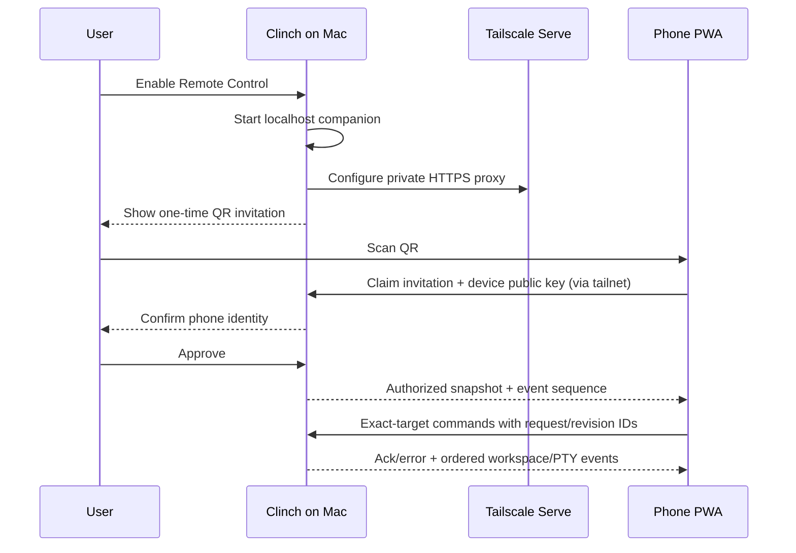

# Clinch Remote Control — Technical Plan

## Context

This plan implements [PRODUCT.md](./PRODUCT.md) in milestones. Milestone 0 initially added honest
product discovery and setup guidance; the same feature series now includes the companion gateway,
private Tailscale transport, paired mobile PWA, control protocol, and attachments.
The implemented trust boundaries, negative guarantees, threat controls, and remaining release gates
are recorded in [SECURITY.md](./SECURITY.md).

The inspected Clinch commit is `7dc234056dec5996e2a199af69595ca56df2edfa`:

- [`README.md`](https://github.com/elliot-ylambda/clinch-terminal/blob/7dc234056dec5996e2a199af69595ca56df2edfa/README.md)
  defines Clinch as local-first, backend-free, no-sign-in, and zero-telemetry. Remote Control must be
  opt-in and preserve those defaults.
- [`app/src/workspace/view.rs`](https://github.com/elliot-ylambda/clinch-terminal/blob/7dc234056dec5996e2a199af69595ca56df2edfa/app/src/workspace/view.rs)
  renders the window header controls and dispatches settings navigation actions.
- [`app/src/workspace/util.rs`](https://github.com/elliot-ylambda/clinch-terminal/blob/7dc234056dec5996e2a199af69595ca56df2edfa/app/src/workspace/util.rs)
  owns durable mouse state for those controls.
- [`app/src/settings_view/clinch_page.rs`](https://github.com/elliot-ylambda/clinch-terminal/blob/7dc234056dec5996e2a199af69595ca56df2edfa/app/src/settings_view/clinch_page.rs)
  is Clinch’s standalone settings surface and already supports categorized, searchable widgets.
- [`app/src/project_window.rs`](https://github.com/elliot-ylambda/clinch-terminal/blob/7dc234056dec5996e2a199af69595ca56df2edfa/app/src/project_window.rs)
  owns the outer project tab strip and aggregated agent/activity state that the mobile project strip
  should mirror.
- [`app/src/app_state.rs`](https://github.com/elliot-ylambda/clinch-terminal/blob/7dc234056dec5996e2a199af69595ca56df2edfa/app/src/app_state.rs)
  already models project windows, windows, tabs, active indices, and pane trees for persistence.
- [`crates/local_control/src/catalog.rs`](https://github.com/elliot-ylambda/clinch-terminal/blob/7dc234056dec5996e2a199af69595ca56df2edfa/crates/local_control/src/catalog.rs)
  and `app/src/local_control/handlers/` provide reusable internal workspace operations. The existing
  network endpoint must not be exposed remotely because its security model assumes a same-user Unix
  socket/loopback client and short-lived action grants.
- [`app/src/terminal/shared_session/mod.rs`](https://github.com/elliot-ylambda/clinch-terminal/blob/7dc234056dec5996e2a199af69595ca56df2edfa/app/src/terminal/shared_session/mod.rs)
  already models ordered scrollback, PTY events, input, and viewer/sharer roles. Its inherited Warp
  network transport is unavailable in Clinch, but the state/event concepts can be adapted.
- [`crates/cli_agent_usage/src/lib.rs`](https://github.com/elliot-ylambda/clinch-terminal/blob/7dc234056dec5996e2a199af69595ca56df2edfa/crates/cli_agent_usage/src/lib.rs)
  contains the provider-neutral usage snapshot forwarded read-only to mobile.
- [`app/src/terminal/session_settings.rs`](https://github.com/elliot-ylambda/clinch-terminal/blob/7dc234056dec5996e2a199af69595ca56df2edfa/app/src/terminal/session_settings.rs)
  and the agent input footer own the effective terminal/agent quick-insert configuration.
- [`script/wasm/dev-index.html`](https://github.com/elliot-ylambda/clinch-terminal/blob/7dc234056dec5996e2a199af69595ca56df2edfa/script/wasm/dev-index.html)
  is a development canvas host, not an installable mobile product. The production mobile shell
  should not load the monolithic desktop WASM application.

The public clinch.sh site is a separate Next.js repository at
`/Users/ellioteckholm/projects/clinch-web` (inspected at `ebdb038`). Website changes land there;
this repo owns the feature contract and in-app links.

## Proposed changes

### Milestone 0 — discovery and truthful onboarding (completed)

1. Add a fixed Remote Control button to backend-free Clinch window headers.
   - Use the existing `Phone01` icon and header-button renderer.
   - Gate it on `!ChannelState::has_backend()` so inherited Warp channels are unchanged.
   - Dispatch the existing `WorkspaceAction::ScrollToSettingsWidget` with
     `SettingsSection::Clinch` and the setup widget's stable ID, so the destination is selected,
     scrolled fully into view, and highlighted.
   - Keep it outside the configurable toolbar list so every Clinch user can discover the feature.
   - Give it its own durable `MouseStateHandle`; do not construct hover state during render.

2. Add a `Remote Control` category at the top of `ClinchSettingsPageView`.
   - Render one overview/status widget followed by ordered Mac, phone, and pairing steps.
   - Open only official URLs from explicit button actions.
   - Mark the section Preview and, in builds predating Milestone 1, keep Pair disabled with a precise
     “companion service not in this build” explanation. The integrated Preview now exposes Pair only
     after the live private companion reaches Ready.
   - Include the no-Clinch-account/Tailscale-account distinction directly in the setup copy.

3. Add focused unit coverage for header action metadata and settings search/action metadata where
   the current UI architecture permits model-level tests. Compile both local/Clinch and inherited
   configurations to catch exhaustive enum and channel-gating regressions.

4. Update clinch.sh in its own repository once located.
   - Add Remote Control (Preview) to the main feature hierarchy rather than burying it in FAQ.
   - Add `/remote-control` with setup, pricing caveat, privacy model, network requirements, and
     current availability.
   - Ship a clearly labeled interactive concept with project switching, the grouped tab drawer,
     the usage/connection sheet, quick-insert preview, and explicit Send behavior. It uses mock
     state only and is not the production companion PWA or a terminal data path.
   - Update metadata and structured feature copy only when the corresponding public build ships.
   - Do not route terminal traffic through the public Next.js site.

### Milestone 1 — local companion and Tailscale activation

5. Create a transport-neutral `clinch_companion_protocol` crate.
   - Version every envelope and include `request_id`, stable target IDs, and expected workspace
     revision on mutations.
   - Use Serde for Rust messages and generate checked-in JSON Schema plus TypeScript definitions to
     prevent drift.
   - Separate small JSON control messages from binary terminal/file frames.
   - Define snapshot DTOs for projects, tabs, panes, agent state, usage, effective quick inserts,
     paired devices, and capabilities.
   - Define commands for navigation, exact-target input/resize/interrupt, tab/session creation,
     toolbelt preview/submit, and later upload begin/chunk/commit/cancel.

6. Add `app/src/remote_control/` with explicit ownership boundaries:
   - `status`: user-visible setup state machine and errors.
   - `tailscale`: installation discovery, signed-in status, private HTTPS/Serve configuration, and
     cleanup. Invoke a resolved executable directly with structured arguments; never build a shell
     command string.
   - `pairing`: invitations, device public keys, capabilities, inactivity, and revocation.
   - `gateway`: localhost HTTP/WebSocket server and static PWA assets.
   - `workspace_adapter`: authoritative snapshots/events and validated commands into Clinch.

7. Resolve supported macOS Tailscale variants in this order:
   - Standalone CLI integration (`/usr/local/bin/tailscale`).
   - Mac App Store/Standalone app-bundled CLI
     (`/Applications/Tailscale.app/Contents/MacOS/Tailscale`) with CLI mode forced for child calls.
   - Other explicit, validated installation paths reported as diagnostic choices rather than
     searching and executing arbitrary PATH entries.

8. On explicit Enable:
   - Start an Axum HTTP/WebSocket server on `127.0.0.1` only.
   - Configure Tailscale Serve as a private HTTPS reverse proxy to that port.
   - Refuse Funnel/public configuration and verify the resulting listener/URL before reporting
     Ready.
   - Persist only the local port/service identity needed for idempotent restart and cleanup.
   - On Disable, remove only the Serve mapping owned by Clinch and stop the listener.

9. Initially keep the gateway inside the Clinch process. Before public beta, split the stable
   endpoint/device registry into a launch-at-login `clinch-companion` helper only if reconnect and
   lifecycle testing proves it necessary. The helper may activate Clinch, but live sessions still
   require the app. This avoids prematurely adding an always-running privileged component.

### Milestone 2 — pairing and read-only mobile vertical slice

10. Pair with public-key device identity:
    - Generate 256-bit random, single-use invitation material with a five-minute expiry.
    - Put the secret in the QR URL fragment so it is not included in ordinary HTTP requests.
    - Have the phone generate a non-exportable WebCrypto signing key where supported.
    - Require desktop confirmation of the presented device and public-key fingerprint.
    - Store only the public key, display metadata, capability grants, timestamps, and revocation
      state on the Mac.
    - Authenticate every reconnect with a fresh signed challenge and short-lived session context.

11. Rely on Tailscale’s WireGuard transport and Serve TLS for transport confidentiality while still
    enforcing Clinch device authentication and authorization. Do not invent a custom encryption
    primitive. If a future Clinch relay is added, introduce an audited application-layer Noise
    channel as a separately reviewed protocol version.

12. Implement the PWA as a separate DOM application in TypeScript, React, and Vite.
    - Build static assets into the Mac application and serve them from the private companion origin.
    - Add manifest, icons, `display: standalone`, `viewport-fit=cover`, theme metadata, and a small
      service worker that caches only the shell/assets.
    - Do not cache live terminal output, prompts, usage, or device credentials in the service
      worker.
    - Use IndexedDB for non-secret UI preferences and the browser key store for device identity.

13. Build the mobile navigation shell before write access:
    - Horizontal project strip.
    - Overlay/pinnable grouped tab drawer.
    - Focus region with connection/target header.
    - Usage/connection bottom sheet.
    - Composer/toolbelt geometry and keyboard/safe-area states, disabled in read-only mode.

14. Use xterm.js for the first terminal vertical slice because it is mature, MIT-licensed, and
    minimizes time to a usable touch terminal. Feed it ordered PTY/scrollback events through a
    narrow adapter. Keep the React shell renderer-independent so an extracted viewer-only
    Rust/WASM renderer can replace it later if Clinch structured-block fidelity cannot be achieved.

15. Synchronize with authoritative snapshots plus ordered live streams:
    - Send an authoritative workspace snapshot after authentication.
    - Give JSON events monotonically increasing per-connection sequence numbers and terminal frames
      monotonically increasing per-stream sequence numbers.
    - In V1, reauthentication always starts a fresh authoritative snapshot and a newly selected
      terminal stream. Keep `last_seen_sequence` and `replayed_from_sequence` in the versioned
      protocol for a future bounded replay implementation, but do not retain terminal contents
      after a WebSocket closes merely to make replay available.
    - On an in-connection sequence gap or terminal receiver overflow, stop accepting input and
      request/reselect an authoritative snapshot instead of presenting stale output as live.
    - Keep input disabled until the target and current snapshot revision are validated.

### Milestone 3 — control, new sessions, usage, and toolbelts

16. Reuse local-control catalog/resolver internals, not its endpoint or bearer-grant assumptions.
    Add a separate capability boundary for `view`, `control`, `create_session`, and later `upload`.

17. Route every mutation through stable project/tab/pane identifiers and revalidate immediately
    before execution. Closing/moving a target returns `target_gone` or `revision_conflict`; there is
    no “latest terminal” fallback.

18. Add one writer lease per pane. Grant it to an authorized phone on focused input, expire it on
    disconnect/inactivity, and allow the desktop to preempt. Broadcast lease state to all viewers.

19. Add typed creation commands:
    - `ProjectCreate { app_instance_id, workspace_revision, project_id, cwd? }`, where `project_id`
      anchors the new project to the same native project window and the command opens its first
      Terminal.
    - `TerminalCreate { app_instance_id, workspace_revision, project_id, cwd? }`
    - `AgentSessionCreate { app_instance_id, workspace_revision, project_id, provider, cwd?,
      initial_prompt }`
    - `AgentSessionResume { app_instance_id, workspace_revision, project_id, provider,
      durable_session_id, cwd }`
    Construct provider commands from existing Clinch agent-resume APIs, never by interpolating
    untrusted mobile strings into a shell.

20. Serialize the latest `UsageSnapshot` without provider tokens or settings mutation capability.
    Include `updated_at`, source, stale/unavailable state, and whether live plan gauges were already
    enabled on desktop. Mobile never triggers Keychain access.

21. Resolve the effective toolbelt on the Mac and send descriptors with opaque item IDs and a
    configuration revision. A tap sends the item ID/revision back; the Mac re-resolves it and
    returns preview text. Explicit Send performs the normal terminal or CLI-agent submission. A
    per-device one-tap preference remains local to that device.

### Milestone 4 — attachment pipeline and hardening

22. Introduce a typed mobile attachment pipeline that can become the `Bytes` branch of a future
    desktop/mobile `Text`, `LocalPath`, and `Bytes { filename, mime, data }` abstraction.
    - Route phone bytes only to a canonical local terminal directory in V1. Explicitly reject SSH
      destinations until Clinch has a structured remote-filesystem API; never route phone metadata
      through the existing interpolated SFTP command builder.
    - Use collision-safe temporary paths and mode `0600` where applicable.
    - Stream chunks with size limits, progress, cancel, retry, and final digest validation.
    - Insert a shell-escaped resulting path without Enter.
    - Do not promote the existing dogfood uploader until interpolation/escaping issues are removed.

23. Complete threat modeling and abuse controls:
    - Invitation replay, wrong key, stale session, revoked device, cross-origin WebSocket, DNS
      rebinding, origin spoofing, oversized frames, decompression bombs, slow clients, target races,
      and malicious filenames.
    - Explicit request/frame/rate/connection limits and bounded snapshots/streams. Do not add a
      reconnect replay buffer until its terminal-content retention and multi-phone semantics have
      been independently reviewed.
    - No terminal contents in logs; identifiers are redacted or random.
    - Desktop-only device management and emergency Disable/Revoke All.

24. Keep a future transport interface around the gateway. A Clinch relay can later implement the
    same authenticated protocol for zero-install phone onboarding, while Tailscale remains the
    private, no-Clinch-backend option.

## End-to-end flow

The public clinch.sh website documents and promotes the feature but is not a participant in this
flow.

## Testing and validation

### Milestone 0

- Unit-test that the header affordance is included only for backend-free Clinch configuration and
  dispatches the Clinch settings section (PRODUCT 1–4).
- Unit-test Remote Control widget search terms and action URLs; verify Preview labeling and that Pair
  follows the live service readiness state (PRODUCT 4–7, 48).
- Run Rust formatting and focused app settings/workspace tests, then `cargo check -p warp` (or the
  repository’s current app package name) for exhaustive action matching.
- Capture desktop screenshots at narrow/wide window sizes and with horizontal/vertical tabs.

### Tailscale and pairing

- Adapter tests with fixture outputs for missing executable, stopped daemon, signed-out state,
  connected state, Serve/HTTPS approval required, unexpected versions, and idempotent cleanup
  (PRODUCT 8–11).
- Cryptographic tests for single use, five-minute expiry, cancellation, replay, wrong key, modified
  challenge, concurrent claims, revocation, and inactivity (PRODUCT 12–18).
- Verify with Mac App Store and Standalone Tailscale variants on supported macOS releases.
- Manual network matrix: same Wi-Fi direct, different Wi-Fi, phone 5G, DERP-relayed path, network
  switch while connected, Mac sleep/wake, Clinch restart, and phone background/foreground
  (PRODUCT 39–43).

### Protocol and control

- Schema compatibility/round-trip tests across Rust and TypeScript and explicit unsupported-version
  behavior.
- Snapshot/event tests for fresh reconnect snapshots, duplicate/reordered/gapped frames, terminal
  overflow fallback, and resync before input (PRODUCT 26, 40–42). Add bounded-buffer eviction tests
  only when retained replay is implemented.
- Workspace tests for project/tab/pane activation, target deletion races, revision conflicts, and the
  invariant that no command falls back to a different target (PRODUCT 21–23, 29–34).
- Writer-lease tests for concurrent phones, desktop preemption, disconnect, and timeout.
- Terminal/Claude/Codex create and resume tests with typed arguments and failure cleanup.
- Usage tests that redact provider credentials and never initiate Keychain access.
- Toolbelt tests for default/custom items, terminal vs agent semantics, hot reload, stale revisions,
  preview-then-send, and optional one-tap mode (PRODUCT 35–37).

### PWA and website

- Playwright component/e2e coverage at representative iPhone and iPad viewports for drawer/focus,
  project overflow, bottom sheet, safe areas, software keyboard geometry, orientation, offline and
  reconnect states, and reduced motion (PRODUCT 19–28, 49).
- Real-device Safari checks for Add to Home Screen, WebCrypto key persistence, WebSocket suspension,
  clipboard/selection, external keyboard, and clearing website data.
- Accessibility audit for names, focus order, contrast, target sizes, screen-reader status updates,
  and non-color status cues.
- Website link and copy tests ensuring the Tailscale sign-in qualification, Preview status, current
  capability list, and privacy architecture remain accurate (PRODUCT 44–48).

### Attachments and security

- Upload tests for local targets, explicit SSH rejection, cancellation, retry, size/digest mismatch,
  collision, path quoting, hostile filenames, and the no-auto-Enter invariant (PRODUCT 38).
- Origin/host validation, DNS-rebinding, oversized/slow frame, fuzz/property tests for protocol
  decoding, and an independent security review before removing Preview.

## Risks and mitigations

- **Tailscale onboarding friction:** detect both Mac variants, provide direct official links and
  actionable states, and keep a future Clinch-relay transport boundary.
- **Header crowding:** use one fixed icon-sized affordance and validate narrow headers; allow usage
  summaries to shrink before hiding Remote Control discovery.
- **Mobile browser suspension:** treat reconnect/resnapshot as normal, never queue hidden commands,
  and expose connection state prominently.
- **Remote shell severity:** app-level device keys, exact targets, capabilities, writer leases,
  revocation, private-only Serve, and no public Funnel.
- **Protocol drift:** one versioned Rust source plus generated schema/TypeScript and compatibility
  tests.
- **Misleading marketing during staged delivery:** Preview labeling and a capability matrix generated
  from release-owned copy; no website claim lands ahead of the corresponding public build.
- **xterm.js fidelity limits:** keep the shell transport/renderer-independent and establish a
  structured-rendering acceptance test before deciding whether to extract a narrow Rust/WASM viewer.

## Parallelization

After the protocol and visual prototype are reviewed, three branches can proceed independently and
merge into one feature series:

- `remote-control-gateway` (local agent, dedicated worktree): protocol, Tailscale adapter, pairing,
  and gateway. Owns Rust crates/modules and security tests.
- `remote-control-pwa` (local agent, dedicated worktree): React/Vite PWA, xterm adapter, mobile UI,
  and Playwright tests. Consumes generated protocol artifacts and does not edit Rust gateway files.
- `remote-control-site` (local agent in the clinch.sh repository): marketing page, setup/security
  docs, metadata, and site tests. Consumes the approved PRODUCT copy and public capability matrix.

Protocol/schema generation and the mobile mock-data contract land sequentially first. Gateway and
PWA then proceed in parallel, integrate in a shared staging branch, and are validated together on
real Mac/iPhone network paths before website claims are promoted beyond Preview.
