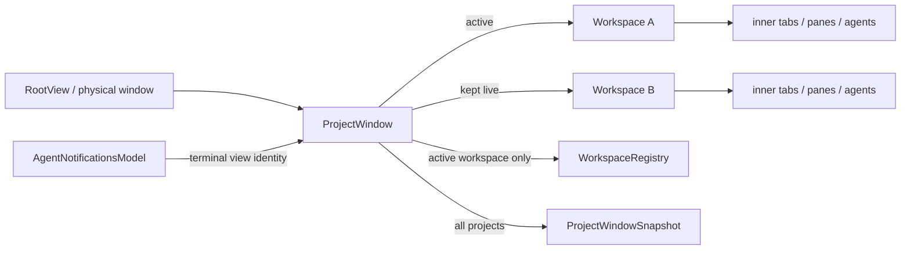

# Project tabs — technical design

## Context

This design implements the user-visible contract in [PRODUCT.md](./PRODUCT.md). Research was performed against commit `8a9025e3a181f71712424009c33285950a54624c`; unrelated local edits in the working tree are not part of this design.

Today a physical window has one `RootView`, whose terminal state owns exactly one `ViewHandle<Workspace>`. That `Workspace` owns every inner tab and nearly all window chrome/state:

- [`RootView`, `AuthOnboardingState`, and `WorkspaceArgs`](https://github.com/warpdotdev/warp/blob/8a9025e3a181f71712424009c33285950a54624c/app/src/root_view.rs#L1550-L1634) establish the one-workspace-per-window ownership boundary.
- [`RootView::render`](https://github.com/warpdotdev/warp/blob/8a9025e3a181f71712424009c33285950a54624c/app/src/root_view.rs#L3412-L3477) renders the terminal workspace directly after auth/onboarding.
- [`Workspace` state](https://github.com/warpdotdev/warp/blob/8a9025e3a181f71712424009c33285950a54624c/app/src/workspace/view.rs#L989-L1160) owns inner tabs, active-tab/MRU state, panel state, header state, and drag state.
- [`Workspace::render_tab_bar_contents`](https://github.com/warpdotdev/warp/blob/8a9025e3a181f71712424009c33285950a54624c/app/src/workspace/view.rs#L20317-L20664) combines window toolbar controls with either vertical-layout header content or horizontal inner tabs.
- [`Workspace::render_tab_bar`](https://github.com/warpdotdev/warp/blob/8a9025e3a181f71712424009c33285950a54624c/app/src/workspace/view.rs#L21011-L21079) owns the physical header surface, traffic-light spacing, tint, dimming, and drop target.
- [`WorkspaceRegistry`](https://github.com/warpdotdev/warp/blob/8a9025e3a181f71712424009c33285950a54624c/app/src/workspace/registry.rs#L1-L64) currently assumes one workspace per `WindowId`; many navigation paths use it to find panes across windows.

The existing code already provides two important primitives:

- [`CrossWindowTabDrag`](https://github.com/warpdotdev/warp/blob/8a9025e3a181f71712424009c33285950a54624c/app/src/workspace/cross_window_tab_drag.rs#L1-L180) provides the precedent and core primitives for transferring a live view tree between windows. Project drag reuses that live-transfer mechanism, while retaining source ownership until drop so it does not need an intermediate preview-window owner.
- [`AgentNotificationsModel` and `NotificationItems::has_unread_for_terminal_view`](https://github.com/warpdotdev/warp/blob/8a9025e3a181f71712424009c33285950a54624c/app/src/ai/agent_management/notifications/item.rs#L130-L216) already associate unread state with terminal view identity. A project dot can be derived from the terminal views owned by that project without creating a second notification store.

Persistence currently mirrors the one-to-one relationship:

- [`AppState` and `WindowSnapshot`](https://github.com/warpdotdev/warp/blob/8a9025e3a181f71712424009c33285950a54624c/app/src/app_state.rs#L28-L73) represent one workspace snapshot per physical window.
- [`get_app_state`](https://github.com/warpdotdev/warp/blob/8a9025e3a181f71712424009c33285950a54624c/app/src/app_state.rs#L367-L410) takes the one registered workspace for each `WindowId`.
- [`save_app_state`](https://github.com/warpdotdev/warp/blob/8a9025e3a181f71712424009c33285950a54624c/app/src/persistence/sqlite.rs#L916-L1080) writes one `windows` row and its tabs, and [`read_sqlite_data`](https://github.com/warpdotdev/warp/blob/8a9025e3a181f71712424009c33285950a54624c/app/src/persistence/sqlite.rs#L2480-L2705) reconstructs the same flat list.

Finally, macOS `Command+N` is currently hard-coded as **New Window** in the app menu, while inner project-like tab cycling already uses `Shift+Command+{` and `Shift+Command+}` through [`CustomAction` key mapping](https://github.com/warpdotdev/warp/blob/8a9025e3a181f71712424009c33285950a54624c/app/src/util/bindings.rs#L250-L342). The requested `Command+[` and `Command+]` project bindings replace the existing pane-navigation and rich-text indentation defaults that previously owned those chords on macOS.

## Proposed changes

### 1. Add a project-window ownership layer

Add `app/src/project_window.rs` with these core types:

```text
ProjectWindow (one per physical normal window)
├── projects: Vec<Project>
├── active_project_index
└── window-scoped header/drag state

Project
├── id: ProjectId
├── workspace: ViewHandle<Workspace>
└── tab interaction and draggable state
```

`ProjectId` is a runtime UUID used for stable action/drag identity; persisted ordering does not depend on it. `ProjectWindow` is a `View` and `TypedActionView` that strongly owns every project workspace so inactive projects remain alive (PRODUCT 1, 6, and 7).

Change the terminal case of `AuthOnboardingState` from `ViewHandle<Workspace>` to `ViewHandle<ProjectWindow>`. `WorkspaceArgs` creates a `ProjectWindow` containing one workspace for normal new-window paths, or several workspaces for grouped restoration. RootView helper methods expose `active_workspace()` and delegate existing pane/tab operations through it. Auth/onboarding states remain outside the terminal container; special terminal windows keep a singleton container but disable project affordances (PRODUCT 34).

Keep `Workspace` as the unit of per-project state. Do not add `project_id` to every `TabData` or flatten projects into one tab vector: that would couple tab indexing, tab groups, panel state, close logic, and session focus across projects. Retaining one `Workspace` per project gives the feature the same isolation users currently get from separate windows.

### 2. Make workspace lookup project-aware

Extend `WorkspaceRegistry` from one weak handle per `WindowId` to a per-window entry containing:

- the active workspace handle;
- all live workspace handles keyed by view/entity ID; and
- APIs to register, unregister, and mark one workspace active.

Preserve `get(window_id)` as “active workspace” so existing active-window callers remain correct. Make `all_workspaces()` include inactive projects and audit callers that currently use `WindowId` as a unique workspace identity. Pane/terminal/conversation navigation resolves a stable pane-group or terminal identity, asks `ProjectWindow` to activate the containing workspace, and only then focuses the inner tab/pane; a separately propagated `ProjectId` is unnecessary (PRODUCT 14 and 33).

Add a small `ProjectWindowRegistry` only if cross-window drag target discovery needs weak `ProjectWindow` handles without downcasting root views. Avoid duplicating workspace ownership in a singleton; RootView/ProjectWindow remain the strong owners.

When a project becomes active, `ProjectWindow` must:

1. mark its workspace active in `WorkspaceRegistry`;
2. update `ActiveSession` for the physical window;
3. update the OS title and active header tint;
4. focus the project's previously focused pane; and
5. request app-state persistence.

Background workspaces must not write physical-window title, focus, or active-session state. Add an `is_active_project(window_id, workspace_id)` guard to current window-global update paths such as `Workspace::update_window_title` (PRODUCT 30).

### 3. Render the project strip in the existing window header

Clinch uses the fixed vertical inner-tab layout, so the existing `Workspace` header remains the authoritative physical-window chrome. It continues to own traffic-light spacing, left and right toolbar controls, window-focus dimming, repository tint, fullscreen/zen visibility, and the header drop surface. For the active workspace, its center header region asks the parent `ProjectWindow` to render the horizontal project strip instead of rendering projects in the vertical inner-tab panel.

`ProjectWindow::render_project_tab_strip` owns only project-level presentation and interaction: the horizontally scrollable tab list, active/inactive styling, unread dots, per-project close buttons, incoming-drag insertion marker, and fixed new-project button. This keeps exactly one copy of the existing window controls and preserves all established header behavior (PRODUCT 3–5).

`ProjectWindow::render` retains a non-vertical fallback that can place the project header above the active workspace, but the shipped Clinch configuration keeps inner tabs vertical. Projects and inner tabs use distinct action types and are never placed in the same list.

Build `ProjectTab` from existing tab primitives where their interaction/shape fits, but keep project state/actions separate from `WorkspaceAction`. Use the active theme's existing foreground, overlay, outline, accent, hover, focus, and corner-radius tokens. The selected project's outline is the intentional exception: use a named constant matching the stable Clinch logo green (`#BFFF00`). Do not modify shared button themes.

Project tab metadata is derived as follows:

- Ask each workspace for the same active project directory used by the former vertical-tabs folder header and the header tint: the detected repository root, otherwise the active local working directory.
- Display that directory's basename in the project tab and remove the separate folder header from the vertical inner-tab panel.
- Fall back to `New Project`.
- Determine unread state by collecting the workspace's terminal view IDs and querying `AgentNotificationsModel` for any unread item.

`Workspace` emits `WorkspaceEvent::ProjectMetadataChanged` when its active inner tab, active terminal session, working directory, or detected repository changes (each workspace also subscribes to `DetectedRepositories`, since repo detection completes asynchronously after a pwd change). `ProjectWindow` subscribes to that event for every owned workspace (and maintains the subscription across live project transfers). Because the strip is mounted inside the *active* workspace's tab bar in vertical-tabs mode, the `ProjectWindow` handler invalidates both itself (horizontal-header placement) and the active workspace, so a background project's metadata change refreshes the strip wherever it renders. This keeps both header placements current without maintaining a duplicate title cache. Clamp labels and expose full text/unread/position through accessibility content (PRODUCT 8–13, 28, and 29).

Layout guardrail: the title bar's height budget is tight and a single-line `Text` whose line height exceeds its max-height constraint is dropped entirely, not clipped. The strip's `ClippedScrollable` must therefore keep zero scrollbar gutter padding (`with_padding_start(0.)`/`with_padding_end(0.)` — the default reserves 4px even with `ScrollbarWidth::None`), and `project_window_tests::project_tab_label_height_budget_fits_one_ui_line` asserts the pill's vertical chrome leaves at least one UI line for the label.

### 4. Add project actions and keybindings

Add `ProjectWindowAction` variants for adding, activating, closing, left/right movement, previous/next navigation, and drag reorder/finish/cancel. The implemented variants are `Add`, `Activate`, `RequestClose`, `CloseActive`, `MoveActiveLeft`, `MoveActiveRight`, `ActivatePrevious`, `ActivateNext`, `Reorder`, `FinishDrag`, and `CancelDrag`.

Register editable `Command+[` and `Command+]` bindings on the project-window/root context. They wrap and no-op for a singleton. Remove the macOS `Command+[` / `Command+]` defaults from the pane-navigation custom actions and rich-text notebook editor while preserving the non-macOS `Control+[` / `Control+]` indentation bindings (PRODUCT 18–19).

Add `CustomAction::NewProject` and make the macOS File/app menu's `Command+N` item dispatch it. The dispatcher targets the active compatible `ProjectWindow`; if there is none, it calls the existing `root_view:open_new` path. Keep an explicit **New Window** menu/global action using the existing `open_new` implementation, without reinterpreting unrelated URI, Dock, CLI, or OS “new window” requests as projects (PRODUCT 15–17).

Creating a project uses `NewWorkspaceSource::Empty` with the current active window as `previous_active_window`, adds the resulting workspace to the end, activates it, and persists. This preserves the same default shell/home behavior as a newly created window.

Project close should reuse the existing close-session confirmation policy. Generalize the close dialog's completion target from “tab or window” to a closure/enum that can request `ProjectWindow::commit_close_project`. Only after confirmation does the container detach/close every pane in that workspace and remove it. A singleton delegates to the existing physical-window close path (PRODUCT 25–27).

### 5. Add live project drag and transfer

Keep the drag state on the source `ProjectWindow`. A project remains owned by its committed source for the duration of pointer movement; WarpUI's `Draggable` supplies the floating tab preview, while screen-space hit testing against each compatible project's saved strip bounds supplies target insertion markers. This avoids creating a duplicate preview owner or transferring a large workspace tree during hover.

For a source containing multiple projects:

1. Record the dragged `ProjectId`, original index, last pointer rect, and current compatible target.
2. Reorder by stable project identity while the pointer remains in the source strip.
3. When the pointer leaves the strip, retain the source ownership and show an insertion marker in the target strip without transferring views.
4. Escape cancels WarpUI's draggable state, clears the target marker, and restores the recorded source index.

On drop:

- A compatible target removes the `Project` from the source vector, calls `transfer_view_tree_to_window` for the live `Workspace`, reparents its structural view-tree edge to the target `ProjectWindow`, inserts it at the indicated index, and activates it.
- Empty desktop creates a normal target window, replaces that window's temporary default workspace with the transferred live project, and positions the window at the drop location.
- A failed transfer rolls any partially moved view IDs back to the source and reinserts the live project at its prior index; a source-strip drop leaves it in the source at a valid position.

For a singleton source, empty-space drop moves the existing physical window instead of creating an empty source. Attaching it elsewhere transfers the project and closes the source with `TerminationMode::ContentTransferred` (PRODUCT 20–24).

`Workspace::on_window_transferred` updates its cached `window_id` and both sides of `WorkspaceRegistry`. The transfer framework updates descendants' dynamic ownership, and `AppContext::reparent_view` updates the creation-time structural graph so future responder chains and transfers follow the new project container.

Because a project has exactly one owner until the drop commits, the global persistence boundary suppresses saves while a project drag is active. The prior committed disk snapshot remains intact during hover, and the completed arrangement is saved after reorder or transfer with no source/temporary-target duplicate window (PRODUCT 32).

### 6. Persist physical windows containing ordered projects

Keep the current `WindowSnapshot` as the snapshot of one project workspace to minimize churn in launch configurations and workspace restoration. Add:

```rust
ProjectWindowSnapshot {
    projects: Vec<WindowSnapshot>,
    active_project_index: usize,
}
```

Change `AppState.windows` to `Vec<ProjectWindowSnapshot>` and make `get_app_state` enumerate each normal physical window's `ProjectWindow`, snapshot every real project in order, and record the active index. Geometry/fullscreen/quake fields may remain duplicated in each contained `WindowSnapshot` initially; they are read from the active project and all projects receive the same physical-window values at save time.

Extend the SQLite `windows` table with backward-compatible grouping metadata:

- nullable `project_window_id TEXT`;
- non-null `project_index INTEGER DEFAULT 0`;
- non-null `is_active_project BOOLEAN DEFAULT TRUE`.

On save, generate one grouping UUID per physical window and write one existing `windows` row per project with shared physical geometry and ordered indices. `app.active_window_id` points at the active project's row in the active physical window. On read, group rows by `project_window_id`, sort by `project_index`, and select the marked active project. Legacy rows with a null group ID become singleton `ProjectWindowSnapshot`s (PRODUCT 2 and 31).

Do not migrate or reinterpret launch configuration windows as multiple projects in the first version. Opening a multi-window launch configuration retains its explicit window semantics; each launched window starts with one project unless the caller explicitly requests opening its single window template in the active project.

### 7. Create ordinary project tabs in managed Git worktrees

Add a public, local-only `ClinchSettings` group with a default-on `auto_create_worktrees_for_new_tabs` boolean at `clinch.projects.auto_create_worktrees_for_new_tabs`. Register it through the normal application and test settings initialization paths. Extend the standalone Clinch settings page with a Projects category and a switch backed by this setting (PRODUCT 35 and 40).

Keep the behavior at the user-action boundary in `Workspace`, rather than changing the low-level tab insertion or terminal constructors. The primary `AddDefaultTab` path and `NewTabInGroup` path first attempt automatic worktree creation for ordinary terminal sessions; the default built-in Agent mode requests an Agent pane so its existing pending-command behavior defers Agent Mode until setup completes. Explicit `AddTerminalTab` callers and feature-specific paths that intentionally use local-control, restoration, cloud, sandbox, custom configuration, alternate shell, split, notification, or deep-link semantics continue calling the existing paths unchanged (PRODUCT 36–37).

Add synchronous, read-only Git preflight helpers beside the existing branch-list helper in `app/src/util/git.rs`:

- Resolve the primary checkout with `git worktree list --porcelain`, so invoking the feature from an already-linked worktree still stores the next checkout beneath the original repository's managed directory.
- Resolve the base ref in fixed order: `refs/heads/main`, then `refs/remotes/origin/main`. Return no plan for non-repositories, missing refs, Git failures, or an unavailable primary checkout.

Build the automatic worktree as an in-memory `TabConfig` rather than writing a persistent user tab-config file. Generate a fresh branch name with the existing `warp_util::worktree_names` helper, reject a generated destination that already exists, and reuse `generated_worktree_path` for Clinch's managed path. The single-pane template starts in the primary checkout and queues `git worktree add -b <branch> <path> <base>` followed by `cd <path>`. Quote generated shell arguments through the same shell-quoting dependency used by tab-config rendering. Preserve normal dynamic tab titles and branch metadata rather than manufacturing a worktree-specific custom title (PRODUCT 38–39 and 41).

For the visible state, add `Repository::is_linked_worktree()` in `repo_metadata`. It must recognize only exact external Git directories shaped like `<common>/.git/worktrees/<name>`; `external_git_directory().is_some()` is insufficient because submodules use `.git` files backed by `.git/modules/...` too. Expose the result through `TerminalView` using the detected repository for its current local cwd. Render a passive `Dataflow02` + **Worktree** chip as a separate right-side badge in expanded vertical rows and as a trailing chip in compact rows, add the rendered label to terminal tab search fragments, and prefix the focused terminal's accessibility content with the same label. Keeping the chip out of the single-priority `Indicator` enum ensures existing status indicators remain visible (PRODUCT 39 and 41).

Add a compact `Dataflow02` toggle to the vertical-tabs control row between its view-options and new-tab buttons. Reuse the existing control-row icon-button sizing, 4px spacing, hover/focus behavior, theme accent for the active state, and tooltip component. Dispatch a `WorkspaceAction` that toggles and saves the existing `ClinchSettings` value; do not add per-project state. Every workspace subscribes to `ClinchSettings` changes so toggling from Clinch Settings or another window immediately refreshes the header. The tooltip reports the current on/off state and explicitly says the preference applies to all projects (PRODUCT 42).

When preflight returns no plan, immediately call the unchanged ordinary-tab path. Runtime command failures remain terminal output and do not trigger cleanup: Git owns the atomicity of branch/worktree creation, `cd` cannot mutate the parent process outside that new terminal, and Clinch does not remove paths or refs on the user's behalf (PRODUCT 40–41).

## End-to-end flow



For notification navigation, terminal identity resolves to a workspace/project, the physical window is focused, `ProjectWindow` activates that project, and only then does `Workspace::focus_pane` activate the inner tab and pane.

## Testing and validation

### Automated coverage

- `project_window_tests.rs` covers macOS shortcut ownership, previous/next wrapping and singleton no-ops, close-neighbor selection, and preserving active-project identity when an inactive project is removed.
- Clinch settings-page tests cover toggling only the new worktree preference and its default-on value.
- Tab-config tests cover the source directory, managed destination, shell-quoted commands, base ref, and terminal-versus-Agent pane type.
- Git utility tests cover primary-checkout resolution from both a main checkout and a linked worktree, plus local/remote `main` ref selection and missing-ref fallback.
- Workspace tests cover action routing: enabled eligible tabs use the worktree template, disabled/ineligible tabs use the existing new-session path, and Agent mode defers entry behind setup commands.
- Workspace and vertical-tabs tests cover toggling the shared automatic-worktree preference from the header action and the header toggle's on/off tooltip copy.
- Repository and vertical-tab tests distinguish linked worktrees from submodules and cover the Worktree chip's search label without displacing existing badge text.
- SQLite tests cover a multi-project physical-window round trip and migration of legacy rows with no project grouping into singleton project windows.
- `warpui_core` transfer tests cover reparenting a live view between project containers so later responder-chain traversal and subtree transfer follow the new owner.
- Compile validation covers the project-aware workspace registry, active-project routing, menus/keybindings, notification identity routing, close confirmation, persistence models, and live cross-window transfer paths.

The remaining behavior is interaction-heavy and must be validated in a running macOS client rather than represented here as tests that do not yet exist.

### Integration and manual validation

- Extend the custom integration framework with a two-project flow: create project, start distinguishable live sessions in each, cycle with both shortcuts, and confirm each project's active inner tab/input survives switching.
- Exercise an unread Claude Code/Codex notification in an inactive project and verify the dot, notification click routing, and read clearing.
- On macOS, record the multi-project drag flows: reorder, detach to desktop, attach to a second window, return to source, Escape, singleton window move, and attach of a singleton source.
- Restart after arranging multiple projects across two windows and compare restored order, active project, inner tabs, pane layouts, and panels.
- Capture screenshots of the vertical-inner-tab layout at normal and narrow/overflow widths, in focused/unfocused windows, and in dark/light appearances.

## Risks and mitigations

- **Inactive workspaces mutate physical-window state.** Centralize title, tint, active-session, and focus updates in `ProjectWindow`, plus active-workspace guards in legacy callbacks.
- **A transferred workspace leaves child views behind.** The transfer API walks render parentage, typed-action parentage, and `View::child_view_ids`; the reparenting test verifies that subsequent responder traversal and transfers follow the target project.
- **Project and inner-tab drags overlap.** Keep their drag handles and state machines separate, rely on the input system's single active pointer drag, and manually validate cancellation at both tab layers.
- **Persistence captures a temporary target or intermediate reorder.** Reuse the existing save suppression boundary for both inner-tab and project drags, then save only after the project reaches one committed owner.
- **Registry callers assume one workspace per window.** Keep the active lookup compatible, add identity-based project activation helpers, and cover same-physical-window inactive-project navigation in tests.
- **Header changes regress window controls or zen mode.** Keep the existing `Workspace` header authoritative and replace only its center content with the project strip, then manually verify traffic-light spacing and hidden-header states.
- **Default-on worktree behavior surprises non-`main` repositories or special tab flows.** Preflight only the two explicit `main` refs, fall back without mutation, and intercept only ordinary user-created terminal/Agent tab actions rather than the shared low-level constructors.
- **Creating a worktree from an existing linked worktree nests managed paths under the generated branch name.** Resolve the primary checkout before naming the managed repository directory and before listing shared branches.
- **Generated paths or branch names are interpreted by the shell.** Pass every dynamic command argument through shell quoting and cover paths containing spaces in the builder tests.
- **A submodule is mislabeled as a linked worktree.** Derive the badge from the exact `.git/worktrees/<name>` external-git-dir shape and cover `.git/modules/<name>` as a negative case.
