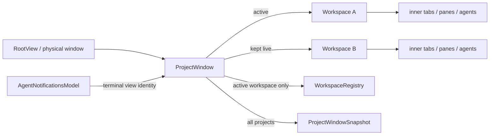

# Project tabs — technical design

## Context

This design implements the user-visible contract in [PRODUCT.md](./PRODUCT.md). Research was performed against commit `8a9025e3a181f71712424009c33285950a54624c`; unrelated local edits in the working tree are not part of this design.

Today a physical window has one `RootView`, whose terminal state owns exactly one `ViewHandle<Workspace>`. That `Workspace` owns every inner tab and nearly all window chrome/state:

- [`RootView`, `AuthOnboardingState`, and `WorkspaceArgs`](https://github.com/warpdotdev/warp/blob/8a9025e3a181f71712424009c33285950a54624c/app/src/root_view.rs#L1550-L1634) establish the one-workspace-per-window ownership boundary.
- [`RootView::render`](https://github.com/warpdotdev/warp/blob/8a9025e3a181f71712424009c33285950a54624c/app/src/root_view.rs#L3412-L3477) renders the terminal workspace directly after auth/onboarding.
- [`Workspace` state](https://github.com/warpdotdev/warp/blob/8a9025e3a181f71712424009c33285950a54624c/app/src/workspace/view.rs#L989-L1160) owns inner tabs, active-tab/MRU state, panel state, header state, and drag state.
- [`Workspace::render_tab_bar_contents`](https://github.com/warpdotdev/warp/blob/8a9025e3a181f71712424009c33285950a54624c/app/src/workspace/view.rs#L20317-L20664) combines window toolbar controls with either vertical-layout header content or horizontal inner tabs.
- [`Workspace::render_tab_bar`](https://github.com/warpdotdev/warp/blob/8a9025e3a181f71712424009c33285950a54624c/app/src/workspace/view.rs#L21011-L21079) owns the physical header surface, traffic-light spacing, tint, dimming, and drop target.
- [`WorkspaceRegistry`](https://github.com/warpdotdev/warp/blob/8a9025e3a181f71712424009c33285950a54624c/app/src/workspace/registry.rs#L1-L64) currently assumes one workspace per `WindowId`; many navigation paths use it to find panes across windows.

The existing code already provides two important primitives:

- [`CrossWindowTabDrag`](https://github.com/warpdotdev/warp/blob/8a9025e3a181f71712424009c33285950a54624c/app/src/workspace/cross_window_tab_drag.rs#L1-L180) implements live view-tree transfer, preview windows, source placeholders, target ghosts, cancellation, and persistence suppression for inner tabs. Project drag should follow this state-machine pattern rather than invent a snapshot/relaunch path.
- [`AgentNotificationsModel` and `NotificationItems::has_unread_for_terminal_view`](https://github.com/warpdotdev/warp/blob/8a9025e3a181f71712424009c33285950a54624c/app/src/ai/agent_management/notifications/item.rs#L130-L216) already associate unread state with terminal view identity. A project dot can be derived from the terminal views owned by that project without creating a second notification store.

Persistence currently mirrors the one-to-one relationship:

- [`AppState` and `WindowSnapshot`](https://github.com/warpdotdev/warp/blob/8a9025e3a181f71712424009c33285950a54624c/app/src/app_state.rs#L28-L73) represent one workspace snapshot per physical window.
- [`get_app_state`](https://github.com/warpdotdev/warp/blob/8a9025e3a181f71712424009c33285950a54624c/app/src/app_state.rs#L367-L410) takes the one registered workspace for each `WindowId`.
- [`save_app_state`](https://github.com/warpdotdev/warp/blob/8a9025e3a181f71712424009c33285950a54624c/app/src/persistence/sqlite.rs#L916-L1080) writes one `windows` row and its tabs, and [`read_sqlite_data`](https://github.com/warpdotdev/warp/blob/8a9025e3a181f71712424009c33285950a54624c/app/src/persistence/sqlite.rs#L2480-L2705) reconstructs the same flat list.

Finally, macOS `Command+N` is currently hard-coded as **New Window** in the app menu, while inner project-like tab cycling already uses `Shift+Command+{` and `Shift+Command+}` through [`CustomAction` key mapping](https://github.com/warpdotdev/warp/blob/8a9025e3a181f71712424009c33285950a54624c/app/src/util/bindings.rs#L250-L342). The requested `Command+{` and `Command+}` bindings are therefore available and semantically distinct.

## Proposed changes

### 1. Add a project-window ownership layer

Add `app/src/project_window/` with these core types:

```text
ProjectWindow (one per physical normal window)
├── projects: Vec<Project>
├── active_project_index
└── window-scoped header/drag state

Project
├── id: ProjectId
├── workspace: ViewHandle<Workspace>
├── draggable state
└── detached-placeholder metadata (only during a drag)
```

`ProjectId` is a runtime UUID used for stable action/drag identity; persisted ordering does not depend on it. `ProjectWindow` is a `View` and `TypedActionView` that strongly owns every project workspace so inactive projects remain alive (PRODUCT 1, 6, and 7).

Change the terminal case of `AuthOnboardingState` from `ViewHandle<Workspace>` to `ViewHandle<ProjectWindow>`. `WorkspaceArgs` creates a `ProjectWindow` containing one workspace for normal new-window paths, or several workspaces for grouped restoration. RootView helper methods expose `active_workspace()` and delegate existing pane/tab operations through it. Auth/onboarding and special-window states remain outside the project container (PRODUCT 34).

Keep `Workspace` as the unit of per-project state. Do not add `project_id` to every `TabData` or flatten projects into one tab vector: that would couple tab indexing, tab groups, panel state, close logic, and session focus across projects. Retaining one `Workspace` per project gives the feature the same isolation users currently get from separate windows.

### 2. Make workspace lookup project-aware

Extend `WorkspaceRegistry` from one weak handle per `WindowId` to a per-window entry containing:

- the active workspace handle;
- all live workspace handles keyed by view/entity ID; and
- APIs to register, unregister, and mark one workspace active.

Preserve `get(window_id)` as “active workspace” so existing active-window callers remain correct. Make `all_workspaces()` include inactive projects and audit callers that currently use `WindowId` as a unique workspace identity. In particular, pane/terminal/conversation navigation must return `(window_id, project_id, locator)`, activate the project through `ProjectWindow`, and only then focus the inner tab/pane (PRODUCT 14 and 33).

Add a small `ProjectWindowRegistry` only if cross-window drag target discovery needs weak `ProjectWindow` handles without downcasting root views. Avoid duplicating workspace ownership in a singleton; RootView/ProjectWindow remain the strong owners.

When a project becomes active, `ProjectWindow` must:

1. mark its workspace active in `WorkspaceRegistry`;
2. update `ActiveSession` for the physical window;
3. update the OS title and active header tint;
4. focus the project's previously focused pane; and
5. request app-state persistence.

Background workspaces must not write physical-window title, focus, or active-session state. Add an `is_active_project(window_id, workspace_id)` guard to current window-global update paths such as `Workspace::update_window_title` (PRODUCT 30).

### 3. Split project header chrome from inner-tab chrome

Refactor the current `Workspace::render_tab_bar*` code into two explicit surfaces:

- `ProjectWindow::render_project_header`, always the top physical-window header for compatible normal windows;
- `Workspace::render_horizontal_inner_tab_bar`, rendered as a second row only when horizontal inner tabs are enabled.

The project header owns traffic-light spacing, window-focus dimming, repository tint, header visibility policy, and the top-level drop target. It renders:

1. the active workspace's configured left toolbar controls;
2. the horizontally scrollable project tab strip;
3. the active workspace's configured right toolbar controls.

Extract the existing left/right toolbar builders and header tint calculation into `pub(crate)` helpers that `ProjectWindow` can call on the active workspace. In vertical mode, stop rendering the old search/header row separately; the project header replaces that row. In horizontal mode, render the existing inner tabs and add-session button beneath the project header without a second copy of traffic lights or window toolbar controls (PRODUCT 3–5).

Build `ProjectTab` from existing tab primitives where their interaction/shape fits, but keep project state/actions separate from `WorkspaceAction`. Use the active theme's existing foreground, overlay, outline, accent, hover, focus, and corner-radius tokens. Do not introduce feature-specific hard-coded colors or modify shared button themes.

Project tab metadata is derived as follows:

- Ask each workspace for the repository-root basename of its active inner tab.
- If that tab has no repository, walk the workspace's existing tab MRU order and use the first resolvable repository basename.
- Fall back to `New Project`.
- Determine unread state by collecting the workspace's terminal view IDs and querying `AgentNotificationsModel` for any unread item.

Because render reads the workspace and notification models, existing `ctx.notify()`/model notifications invalidate the header without maintaining a duplicate title or unread cache. Clamp labels and expose full text/unread/position through accessibility content (PRODUCT 8–13, 28, and 29).

### 4. Add project actions and keybindings

Add `ProjectWindowAction` variants for:

- `AddProject`;
- `ActivateProject(ProjectId)`;
- `ActivatePreviousProject` / `ActivateNextProject`;
- `MoveProject { id, target_index }`;
- `CloseProject(ProjectId)`;
- project drag start/update/drop/cancel actions.

Register editable `Command+{` and `Command+}` bindings on the project-window/root context. They wrap and no-op for a singleton (PRODUCT 18–19).

Add `CustomAction::NewProject` and make the macOS File/app menu's `Command+N` item dispatch it. The dispatcher targets the active compatible `ProjectWindow`; if there is none, it calls the existing `root_view:open_new` path. Keep an explicit **New Window** menu/global action using the existing `open_new` implementation, without reinterpreting unrelated URI, Dock, CLI, or OS “new window” requests as projects (PRODUCT 15–17).

Creating a project uses `NewWorkspaceSource::Empty` with the current active window as `previous_active_window`, adds the resulting workspace to the end, activates it, and persists. This preserves the same default shell/home behavior as a newly created window.

Project close should reuse the existing close-session confirmation policy. Generalize the close dialog's completion target from “tab or window” to a closure/enum that can request `ProjectWindow::commit_close_project`. Only after confirmation does the container detach/close every pane in that workspace and remove it. A singleton delegates to the existing physical-window close path (PRODUCT 25–27).

### 5. Add live project drag and transfer

Add `ProjectWindowDrag`, a singleton state machine modeled on `CrossWindowTabDrag` with `Floating`, `GhostInTarget`, `InsertedInTarget`, and `Transitioning` phases. Reuse the existing screen/window coordinate and attach-target conventions where possible, but keep project and inner-tab drags mutually exclusive.

For a source containing multiple projects:

1. Freeze source metadata and replace the source entry with a lightweight placeholder.
2. Activate a neighboring real project if the dragged project was active.
3. Create a no-focus preview `RootView`/`ProjectWindow` at the source window size.
4. Transfer the dragged `Workspace` and its entire declared child view tree into the preview using `transfer_view_tree_to_window`.
5. Follow the pointer and render target insertion ghosts without transferring again on hover.

On drop:

- Empty desktop promotes the preview to a normal focused window.
- A compatible target transfers the same workspace subtree from preview to target, inserts it at the ghost index, marks it active, removes the source placeholder, and closes the preview.
- Source-strip return or Escape transfers the workspace back into its placeholder position.
- Any failed step rolls back to the last committed owner before clearing drag state.

For a singleton source, use the physical source window as the floating preview, matching the existing single-inner-tab drag optimization. Attaching it elsewhere transfers the project and then closes the empty source; dropping on empty space leaves the moved window intact (PRODUCT 20–24).

Implement `View::on_window_transferred` or an explicit `Workspace::rebind_window(old, new)` hook to update the stored `Workspace.window_id`, registry membership, active-session keys, and any other cached physical-window identity after subtree transfer. Audit child views that cache `WindowId`; the transfer framework already updates dynamic view ownership, so only explicit cached IDs require rebinding.

Block `workspace:save_app` while either inner-tab or project drag has uncommitted duplicate/placeholder state, then trigger one save after finalization (PRODUCT 32).

### 6. Persist physical windows containing ordered projects

Keep the current `WindowSnapshot` as the snapshot of one project workspace to minimize churn in launch configurations and workspace restoration. Add:

```rust
ProjectWindowSnapshot {
    projects: Vec<WindowSnapshot>,
    active_project_index: usize,
}
```

Change `AppState.windows` to `Vec<ProjectWindowSnapshot>` and make `get_app_state` enumerate each normal physical window's `ProjectWindow`, snapshot every real project in order, and record the active index. Geometry/fullscreen/quake fields may remain duplicated in each contained `WindowSnapshot` initially; they are read from the active project and all projects receive the same physical-window values at save time.

Extend the SQLite `windows` table with backward-compatible grouping metadata:

- nullable `project_window_id TEXT`;
- non-null `project_index INTEGER DEFAULT 0`;
- non-null `is_active_project BOOLEAN DEFAULT TRUE`.

On save, generate one grouping UUID per physical window and write one existing `windows` row per project with shared physical geometry and ordered indices. `app.active_window_id` points at the active project's row in the active physical window. On read, group rows by `project_window_id`, sort by `project_index`, and select the marked active project. Legacy rows with a null group ID become singleton `ProjectWindowSnapshot`s (PRODUCT 2 and 31).

Do not migrate or reinterpret launch configuration windows as multiple projects in the first version. Opening a multi-window launch configuration retains its explicit window semantics; each launched window starts with one project unless the caller explicitly requests opening its single window template in the active project.

## End-to-end flow



For notification navigation, terminal identity resolves to a workspace/project, the physical window is focused, `ProjectWindow` activates that project, and only then does `Workspace::focus_pane` activate the inner tab and pane.

## Testing and validation

### Unit and view tests

- `project_window_tests.rs`: singleton initialization/migration, `Command+N` insertion and activation, click activation, previous/next wrap, reorder stability, close-neighbor selection, and preservation of inactive workspace handles (PRODUCT 1–7, 15–20, 25–27).
- Project metadata tests: active-repository naming, MRU fallback, `New Project`, duplicate names, truncation metadata, and unread roll-up/clear behavior using terminal view IDs (PRODUCT 8–13).
- Header view tests in both vertical and horizontal modes: project tabs only in the top strip, inner tabs only in their existing surface, one set of traffic lights/toolbars, overflow behavior, and active/accessibility state (PRODUCT 3–5, 28–30).
- Navigation tests: a notification/pane locator in an inactive project activates the correct project before focusing its inner tab; searches across workspaces no longer skip inactive projects in the current physical window (PRODUCT 14 and 33).
- Drag state-machine tests: local reorder, multi-project preview detach, target attach, singleton move/attach, Escape rollback, rejected target rollback, view-tree identity preservation, and persistence suppression (PRODUCT 20–24 and 32).
- Persistence tests: legacy ungrouped rows restore as singleton projects; multiple physical groups round-trip project order/active indices and all existing tab/pane fields; the active physical window remains correct (PRODUCT 2 and 31–32).
- Menu/keybinding tests: `Command+N` is New Project, explicit New Window still dispatches `open_new`, `Command+{`/`Command+}` target projects, and existing shifted inner-tab shortcuts are unchanged (PRODUCT 15–19 and 27).

### Integration and manual validation

- Extend the custom integration framework with a two-project flow: create project, start distinguishable live sessions in each, cycle with both shortcuts, and confirm each project's active inner tab/input survives switching.
- Exercise an unread Claude Code/Codex notification in an inactive project and verify the dot, notification click routing, and read clearing.
- On macOS, record the multi-project drag flows: reorder, detach to desktop, attach to a second window, return to source, Escape, singleton window move, and attach of a singleton source.
- Restart after arranging multiple projects across two windows and compare restored order, active project, inner tabs, pane layouts, and panels.
- Capture screenshots for vertical and horizontal inner-tab modes at normal, narrow/overflow, unfocused, dark, and light appearances.

## Risks and mitigations

- **Inactive workspaces mutate physical-window state.** Centralize title, tint, active-session, and focus updates in `ProjectWindow`, plus active-workspace guards in legacy callbacks.
- **A transferred workspace leaves child views behind.** Ensure every workspace-owned view is reachable through render/typed-action parentage or `View::child_view_ids`; add a transfer test that compares the complete pre/post child ID set.
- **Project and inner-tab drags overlap.** Permit only one global drag controller at a time and make each header's context flags disable the other drag source until finalization.
- **Persistence sees duplicate terminal UUIDs during preview.** Reuse the existing save suppression pattern and persist only after the transfer reaches a single committed owner.
- **Registry callers assume one workspace per window.** Keep the active lookup compatible, add identity-based project activation helpers, and cover same-physical-window inactive-project navigation in tests.
- **Header refactoring regresses window controls or zen mode.** Move the existing traffic-light, dimming, tint, and visibility code rather than duplicating it, and retain the existing regression tests around traffic-light spacing and hidden headers.
